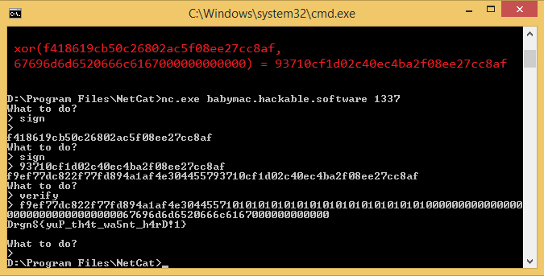

<p style="direction: rtl">
نگاه کلی:</br>
چیزی که توی اینجور برنامه ها و مسعله ها مهمه اینه که تگی که برای هر دیتا استفاده شده معتبر باشه</br>
برای مثال وقتی که دونفر با هم communicate میکنن بوسیله تگی که از روی دیتا ها ساخته میشن میشه فهمید که دیتایی که به ما فرستاده شده
</br> دیتای درستی هستش یا اینکه نه و توی مسیر این دیتا دستکاری شده. کدی که توی سرور این تگ هارو میساخت این بود :
</p>

```python
def sign(data, key):
    data = pad(data, 16)
    blocks = split_by(data, 16)
    mac = b'\0' * 16
    aes = AES.new(key, AES.MODE_ECB)
    for block in blocks:
        mac = xor(mac, block)
        mac = aes.encrypt(mac)
    mac = aes.encrypt(mac)
    return mac
```

<p style="direction: rtl">
این قسمت از کد خیلی شبیه mode cbc هستش و به عبارتی این قسمت از کد بلاک اخر رمز شده دیتا با مود cbc را میگیرد و سپس آن را یکبار </br>
دیگر encrypt میکند.</br>
</p>

```python
def verify(data, key):
    if len(data) < 16:
        return False, ''
    tag, data = data[:16], data[16:]
    correct_tag = sign(data, key)
    if tag != correct_tag:
        return False, ''
    return True, data
```

<p style="direction: rtl">
اینجا هم همون قسمتی هستش که توی سرور تگ دیتایی که فرستادیم رو چک میکنه اگه دقت کنید 16 بایت اول ورودی ما همون تگی هستش که سرور </br>
چک میکنه ببینه valid هستش یا نه و اگه بود داخل دیتای مارو میگرده و میبینه اگه عبارت 'b'gimme flag داخل دیتا باشه فلگ رو به ما نشون</br>
میده و ما تنها کاری که باید بکنیم این هستش که بدون اینکه داخل sign از این عبارت استفاده کرده باشیم. عبارتی رو درست کنیم که موقع verify </br>
کردن تگ درستی داشته باشه و عبارت gimme flag رو داخل خودش داشته باشه.</br>
اکسپلویت:</br></p>

```python
m = (b'\x10' * 16).hex()
print(r.sendlineafter(b'> ', b'sign').decode(), 'sign')
print(r.sendlineafter(b'> ', b''), '')
t = bytes.fromhex(r.recvline().decode().strip())[:16]
print("t is : ", t.hex())
```

<p style="direction: rtl">
در این قسمت ما b'' را به سمت سرور میفرستیم تا عملیات sign رو برامون انجام بده و چون دیتایی که فرستادیم</br>
خالی بود بعد از pad کردن به b'\x10' * 16 تبدیل خواهد شد.</br>
(اما اگر بجای''b  ما b'\x10' * 16 را به سرور بفرستیم توی پدینگ به b'\x10' * 32 تبدیل خواهد شد)</br>
در این جا اگر ما با sign کردن ''b به چنین تگی برسیم:</br></p>

```
f418619cb50c26802ac5f08ee27cc8af
```

<p style="direction: rtl">
دیتایی که با verify کردن آن به فلگ میرسیم به اینصورت خواهد بود:</br></p>

```
f9ef77dc822f77fd894a1af4e3044557101010101010101010101010101010100000000000000000000000000000000067696d6d6520666c6167000000000000
```

<p style="direction: rtl">
که تگ ان که در 16 بایت اول قرار گرفته به اینصورته:</br></p>

```
f9ef77dc822f77fd894a1af4e3044557
```
<p style="direction: rtl">
اگر بلاک های دیتا را از هم جدا کنیم خواهیم داشت:</br>
بلاک 1:</br>
</p>

```
10101010101010101010101010101010
```

<p style="direction: rtl">
بلاک 2:</br>
</p>

```
00000000000000000000000000000000
```

<p style="direction: rtl">
بلاک 3 حاوی عبارت gimme flag :</br>
</p>

```
67696d6d6520666c6167000000000000
```

<p style="direction: rtl">
ما برای ساخت payload تگ b'\x10' * 16  را داشتیم اما دوبار انکریپت شده بود زیرا اخرین بلاک بود اما اینجا بدیل اینکه اولین بلاک هستش</br>
و بعد از اون ما بلاک های دیگری هم داریم بلاک بعدی را b'\x00' * 16 قرار میدهیم زیرا با xor شدن بلاک قبلی با این بلاک </br>
نتیجه هیچ تغییری نمیکند و بلاک اول بار دیگر هم انکریپت شده و در نهایت به تگی که در مرحله اول بدست اوردیم</br>
خواهیم رسید و حالا در مرحله بعدی تگی که بدست اورده بودیم با بلاک سوم که عبارت مورد نیاز ما داخلش هست xor میشود و پس از ان انکریپت میشود</br>
و سپس انکریپت میشود و تگ نهایی بدست میاد. ما اینجا بلاک سوم رو داریم و همینطور تگی که با بلاک سوم xor میشود و تنها چیزی که میخواهیم</br>
مقدار انکریپت شده ی آن است تا به تگ نهایی برسیم که بوسیله دستور sign میتوانیم مقدار xor شده را انکریپت کنیم.
</p>

```
> sign
> xor(f418619cb50c26802ac5f08ee27cc8af, 67696d6d6520666c6167000000000000)
```

<p style="direction: rtl">
خواهیم داشت :
</p>

```
f9ef77dc822f77fd894a1af4e3044557
```

<p style="direction: rtl">
که تگ مورد نیاز ما برای verify کردن دیتا است و با گذاشتن این تگ پشت اون 3 بلاک دیتا به فلگ خواهیم رسید.</br>


امیدوارم که خوب توضیح داده باشم :)
</p>